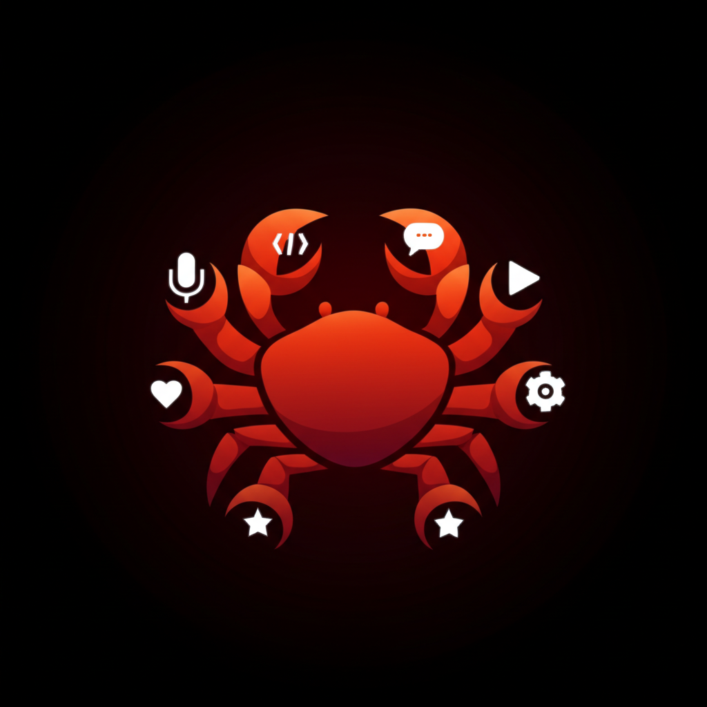

# 🦀 KrabWidget

<div align="center">



### **Your AI companion, always listening**

*Like Shiva with 8 arms - doing everything at once!*

[](https://swift.org)
[](https://www.apple.com/macos/)
[](LICENSE)

**Talk to your AI. It talks back. It does EVERYTHING.** 🎤🔊

[Features](#-features) • [Installation](#-installation) • [AI Setup](#-ai-backend-setup) • [Easter Eggs](#-easter-eggs) • [Contributing](#-contributing)

</div>

---

<div align="center">


*Krab: Typing, chatting, coding, playing music, managing tasks - all at once!*
</div>

---

## ✨ What is KrabWidget?

KrabWidget is a **voice-first AI assistant** for macOS that lives on your desktop. Like the Hindu god Shiva with multiple arms, Krab handles **everything at once** - listening to you, responding with voice, checking your messages, managing notifications, and looking incredibly cool while doing it.

### 🎤 Voice In, Voice Out

```
You: "Hey Krab, tell me a joke"
Krab: "Why don't crabs ever share? Because they're SHELL-FISH! 🦀 CLACK CLACK!"
```

---

## 🚀 Features

<table>
<tr>
<td width="50%">

### 🎙️ Voice Commands
- **Always listening** with "Hey Krab" wake word
- **Global hotkey** (⌘⌥Space) to toggle
- Real-time **waveform visualization**
- Apple Speech framework

</td>
<td width="50%">

### 🔊 Voice Personalities
- 😊 **Friendly Krab** - Warm & welcoming
- 🎓 **Professor Crab** - Sophisticated
- 🎉 **Pinchy** - Playful & fun
- 🌊 **Coral** - Calm & soothing
- 🤖 **Shell-9000** - Robotic

</td>
</tr>
<tr>
<td width="50%">

### 🦀 Crab Status Widget
Always-visible status showing Krab's activity:
- 🔍 "Researching anime recommendations..."
- 📧 "Checking your emails..."
- 🎮 "Found cool gaming news!"
- 😴 "Chilling, waiting for you..."

**Mood & Energy system** - Krab gets tired!

</td>
<td width="50%">

### 📬 Pop-up Notifications
- Dynamic notifications with smooth animations
- News, recommendations, alerts, tips
- Queue system for multiple notifications
- Auto-dismiss or click to dismiss

</td>
</tr>
<tr>
<td width="50%">

### 📱 Telegram Integration
- Real-time message receiving
- Visual and audio notifications
- Krab reads messages aloud
- Beautiful chat bubbles

</td>
<td width="50%">

### 🪟 Modular Windows
- **Chat Window** - Voice + messages
- **Quick Actions** - Custom buttons
- **Command Output** - Mini terminal
- All draggable & resizable!

</td>
</tr>
</table>

### 🎨 Themes

| Theme | Description |
|-------|-------------|
| 🔴 **Shiva Red** (NEW!) | Powerful red like the mascot |
| 🔵 **Deep Ocean** | Calm blue depths |
| 🟠 **Coral Reef** | Warm orange tones |
| 🟣 **Midnight** | Dark purple elegance |
| 🟡 **Sunset** | Golden hour vibes |

### 🥚 Easter Eggs (13 Secrets!)
- 🎵 **Crab Rave** - Say "crab rave"!
- 🌀 **Barrel Roll** - Acrobatic fun
- 🪩 **Disco Mode** - Party lights
- 🎮 **Konami Code** - ⬆️⬆️⬇️⬇️⬅️➡️⬅️➡️BA
- And 9 more to discover...

---

## 📥 Installation

### Requirements
- macOS 14.0 (Sonoma) or later
- Microphone permissions

### Quick Start

```bash
# Clone
git clone https://github.com/Sleywill/KrabWidget.git
cd KrabWidget

# Open in Xcode
open KrabWidget.xcodeproj

# Build and run (⌘R)
```

---

## 🤖 AI Backend Setup

KrabWidget supports multiple AI backends:

### 🏠 Ollama (Recommended - Free & Local)

```bash
# Install
brew install ollama

# Start
ollama serve

# Pull model
ollama pull llama3.2
```

Settings → AI Backend → Ollama → Connect

### ☁️ Other Options
- **OpenAI** - GPT-4, GPT-4o Mini
- **Anthropic** - Claude 3
- **OpenClaw** - Your gateway
- **Custom API** - Any compatible endpoint

See [docs/SETUP.md](docs/SETUP.md) for detailed instructions.

---

## 📱 Telegram Setup

1. Message [@BotFather](https://t.me/BotFather) on Telegram
2. Send `/newbot` and follow instructions
3. Copy the token
4. Settings → Telegram → Paste → Connect

---

## ⌨️ Shortcuts

| Shortcut | Action |
|----------|--------|
| ⌘⌥Space | Toggle voice listening |
| ⌘, | Open Settings |
| ⌘N | New window |

---

## 🏗️ Architecture

```
KrabWidget/
├── Managers/
│   ├── SpeechManager      # Voice input
│   ├── VoiceManager       # Voice output
│   ├── TelegramManager    # Messages
│   ├── AIBackendManager   # AI connections
│   ├── NotificationManager # Pop-ups
│   ├── CrabStatusManager  # Status widget
│   └── EasterEggManager   # Fun surprises
├── Views/
│   ├── ChatView, OnboardingView
│   ├── SettingsView, QuickActionsView
│   └── AIBackendSettingsView
└── Components/
    ├── WaveformView       # Audio viz
    └── GlassMorphism      # Visual effects
```

---

## 🔒 Privacy

- **Local speech** via Apple frameworks
- **Your choice** of AI backend (use Ollama for 100% privacy)
- **No analytics** or tracking
- **Open source** - verify yourself!

---

## 🤝 Contributing

See [CONTRIBUTING.md](CONTRIBUTING.md) for guidelines.

Ideas welcome:
- More voice packs
- More easter eggs
- Plugin system
- Calendar/reminders
- Localization

---

## 📄 License

MIT License - use, modify, distribute freely!

---

<div align="center">


**Made with ❤️ by [Sleywill](https://github.com/Sleywill)**

*"With 8 arms, no task is too big!"* - Krab 🦀

**[⭐ Star this repo](https://github.com/Sleywill/KrabWidget)** if you like it!

</div>
